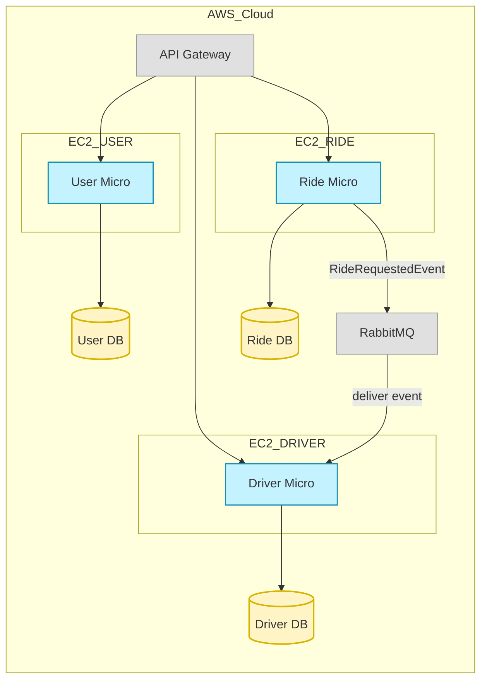

# Architecture of Massively distributed applications

Este README documenta el taller donde se diseñó e implementó una arquitectura de microservicios para una plataforma tipo Uber.

## 1. Enunciado del Ejercicio

**"Design a Microservice Architecture for a Ride-Sharing Platform (Uber)."**

### Objetivo
Diseñar y prototipar una arquitectura modular de microservicios que permita manejar:

- Users
- Drivers
- Rides

Se debe:

- Modelar entidades y recursos
- Definir URIs modelo REST
- Definir representaciones
- Mapear HTTP methods correctos
- Asegurar escalabilidad / desacopacoplamiento via eventos
- Simular real-time assignment driver → ride
- Integración Cloud (API GW + EC2 + DB)

## 2. Arquitectura Implementada

| Microservice | Función | Persistence | Comunicación                        |
|---|---|---|-------------------------------------|
| user-service | registra usuarios | BD propia | REST                                |
| driver-service | registra drivers / status | BD propia | REST                                |
| ride-service | crea ride / asigna driver | BD propia | REST / publica eventos via RabbitMQ |
| rabbitMQ | event bus | - | fanout                              |

### Flujo Base Implementado

1. `RideService` crea Ride
2. `RideService` publica evento "ride.requested" → RabbitMQ
3. `DriverService` escucha evento y asigna Ride a Driver cercano disponible
4. `RideService` actualiza DB y status → ASSIGNED

## 3. Recursos / Modelo

### Users
- id (UUID)
- name
- email
- phone

### Drivers
- id (UUID)
- userId
- name
- phone
- status

### Rides
- id (UUID)
- userId (pasajero)
- driverId
- pickupLat
- pickupLng
- dropoffLat
- dropoffLng
- status

## 4. REST URIs

### users-service
| Method | URI        | Description    |
|--------|------------|----------------|
| POST   | /users     | crea usuario   |
| GET    | /users     | lista usuarios |
| GET    | /user/{id} | lista usuario  |

### driver-service
| Method | URI | Description |
|---|---|---|
| POST | /drivers | crea driver |
| GET | /drivers | lista drivers |
| PUT | /drivers/{id}/status | cambia estado |

### ride-service
| Method | URI | Description |
|---|---|---|
| POST | /rides | crea ride |
| GET | /rides | lista rides |
| PUT | /rides/{id}/assign | asigna driver |

Representación estándar: **JSON**

# 5. Cloud Setup

En este despliegue se implementa la arquitectura en **AWS** con la siguiente configuración:

* **API Gateway**: entrada única de todas las peticiones REST, enruta hacia cada microservicio.
* **EC2 Instances**: un EC2 por microservicio (Users, Drivers, Rides). Cada micro corre en su contenedor Docker.
* **Bases de datos MySQL**: cada micro tiene su propia BD MySQL independiente:

    * `user-db` → EC2 de User Service
    * `driver-db` → EC2 de Driver Service
    * `ride-db` → EC2 de Ride Service
* **RabbitMQ**: servicio de mensajería para eventos asincrónicos (ride requests) que permite desacoplar los microservicios.


Flujo de comunicación (asignación de Ride):

1. Cliente → API Gateway → microservicio correspondiente.
2. RideService publica evento `RideRequestedEvent` en RabbitMQ.
3. DriverService consume evento y actualiza ride.
4. RideService actualiza su BD MySQL con la asignación.


# 6. Deployment

**Prerequisitos**:

* AWS EC2 instances para cada micro
* Docker instalado en cada EC2
* MySQL corriendo en cada EC2 (contenedor o servicio nativo)
* RabbitMQ corriendo en EC2 (o Amazon MQ)
* API Gateway configurado para enrutar tráfico a cada EC2

**Pasos resumidos para levantar microservicios en EC2 con Docker**:

1. Construir imagen Docker de cada microservicio:

```bash
docker build -t users-service ./users
docker build -t drivers-service ./drivers
docker build -t rides-service ./rides
```

2. Ejecutar contenedores y mapear puertos:

```bash
docker run -d -p 8081:8080 --name users-service users-service
docker run -d -p 8082:8080 --name drivers-service drivers-service
docker run -d -p 8083:8080 --name rides-service rides-service
```

3. Levantar MySQL (un contenedor por micro):

```bash
docker run -d -p 3306:3306 --name user-db -e MYSQL_ROOT_PASSWORD=root -e MYSQL_DATABASE=users user-mysql-image
docker run -d -p 3307:3306 --name driver-db -e MYSQL_ROOT_PASSWORD=root -e MYSQL_DATABASE=drivers driver-mysql-image
docker run -d -p 3308:3306 --name ride-db -e MYSQL_ROOT_PASSWORD=root -e MYSQL_DATABASE=rides ride-mysql-image
```

4. Configurar variables de entorno de los microservicios para conectar con su BD respectiva y RabbitMQ.

5. Desde API Gateway, probar rutas REST (`/users`, `/drivers`, `/rides`) apuntando a los EC2.

6. Validar la comunicación asincrónica: crear un ride → evento publicado en RabbitMQ → driver toma ride → ride actualizado en su DB.


---

## 7. Diagrama de Despliegue



## 8. Swagger / OpenAPI

Cada microservice expone swagger en su propio host + `/swagger-ui.html`.

Accesos reales:

| Micro          | Swagger UI                           |
| -------------- | ------------------------------------ |
| user-service   | `http://{host}:8081/swagger-ui.html` |
| driver-service | `http://{host}:8082/swagger-ui.html` |
| ride-service   | `http://{host}:8083/swagger-ui.html` |


## 9. Testing de microservicios con Postman

Ejemplo rápido para ver el comportamiento de las peticiones.

Importar la colección de postman:

[AYGO - Uber.postman_collection.json](./AYGO%20-%20Uber.postman_collection.json)

1. Abrir Postman
2. File → Import
3. Seleccionar el archivo
4. Ejecutar los requests incluidos


